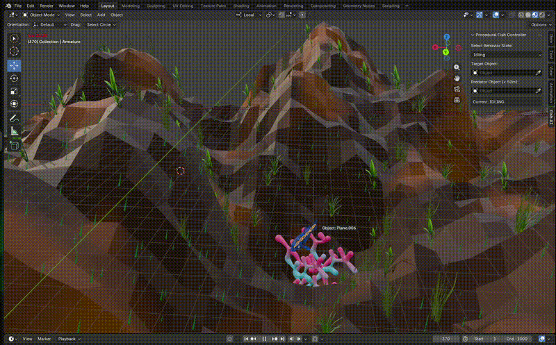
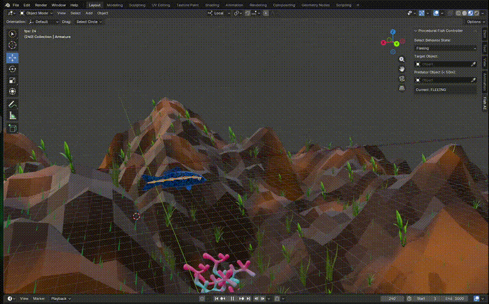

# Procedural Fish AI Simulation in Blender

This project demonstrates a **procedural skeletal animation system**
implemented in Blender using Python.\
The goal of the project is to showcase how skeletal motion, simple
behavioral logic, and environmental sensing can be combined to generate
autonomous movement for a marine creature.

The fish moves autonomously within a scene while maintaining natural
swimming motion through procedural bone animation.\
The system integrates **behavior states, obstacle detection, terrain
awareness, and target interaction** to simulate believable underwater
navigation.

This project was created as part of an **entry task focused on
skeleton‑based procedural animation concepts**.

------------------------------------------------------------------------

## Demo

The repository includes a short demonstration showing:

-   Procedural swimming animation
-   Autonomous navigation
-   Terrain avoidance
-   Predator fleeing behavior
-   Target seeking behavior

The plant object in the scene is used as the predator for demonstration purposes :

The UI panel usage : 

Full video: fish_ai.mp4

------------------------------------------------------------------------

## Requirements

-   Blender **5 or newer**
-   No external dependencies

------------------------------------------------------------------------

## Running the Simulation

1.  Download or clone this repository.
2.  Open `Cinematic_demo.blend` in **Blender**.
3.  Switch to the **Scripting** workspace.
4.  Select the included Python script.
5.  Click **Run Script**.
6.  Press **Play** on the timeline.(It is recommended to play this in the Layout workspace & in the Material preview viewport due to general computational constraints in the render tab)

Select the fish armature (the spine skeleton of the fish) & then a **Fish AI panel** will appear in the 3D viewport sidebar.
Press **N** to open the sidebar and access the controller.

------------------------------------------------------------------------

## Fish AI Control Panel

The Fish AI panel allows you to:

-   Select the fish **behavior state**
-   Assign a **target object**
-   Assign a **predator object**

When a predator enters a radius of approximately **50 units**, the fish
transitions into a fleeing state.

------------------------------------------------------------------------

# Core Techniques Used

## Frame-Based Procedural Animation

The animation system is driven using Blender's frame update handler:

    bpy.app.handlers.frame_change_pre.append(procedural_anim_handler)

This handler executes once per frame and updates:

-   fish behavior state
-   navigation direction
-   velocity
-   skeletal pose

The animation is therefore generated **procedurally in real time**
rather than using keyframed animation.

------------------------------------------------------------------------

## Finite State Machine (Behavior Control)

The fish behavior is controlled using a simple **finite state machine
(FSM)** with four states:

-   **IDLING** -- minimal motion
-   **SWIMMING** -- normal exploration & locomotion behavior
-   **FLEEING** -- escape behavior 
-   **TURNING** -- rotation to change direction 

Each state uses a unique set of parameters defined in `STATE_PARAMS`
which control:

-   swimming amplitude
-   wave propagation speed
-   body wave length
-   forward velocity
-   turning speed

This allows each behavior state to exhibit different locomotion
characteristics.

------------------------------------------------------------------------

## Context-Based Steering

Movement direction is determined using a context steering approach.

The fish first computes an **ideal direction** based on behavioral
priorities:

1.  Escape from predator
2.  Move toward target
3.  Wander randomly

Example direction calculation:

    ideal_dir = (target - obj.location).normalized()

This vector becomes the desired heading for navigation.

------------------------------------------------------------------------

## Multi-Ray Obstacle Detection

To detect obstacles, the system casts multiple rays around the fish's
forward direction.

The rays sample two orthogonal planes:

-   forward/right plane
-   forward/up plane

Directional sampling:

    for i in range(16):
        angle = (i / 16.0) * 2π

Each candidate direction is evaluated using Blender's ray casting API:

    scene.ray_cast(depsgraph, origin, direction)

This allows the fish to detect terrain or obstacles before collision.

------------------------------------------------------------------------

## Direction Scoring and Selection

Each sampled direction receives a score based on:

**Alignment with desired direction**

    score = dot(test_dir, ideal_dir)

**Collision risk penalty**

    penalty = (1 - hit_distance / max_distance)

The direction with the highest score becomes the new steering direction.

This produces smooth avoidance behavior without abrupt direction
changes.

------------------------------------------------------------------------

## Terrain Height Control

To prevent the fish from intersecting terrain, a **three-point terrain
probe** is used.

Downward raycasts are performed from:

-   head
-   body center
-   tail

Example offsets:

    [ forward_offset, center_offset, backward_offset ]

The minimum detected distance determines whether the fish needs to
climb.

If the fish is too close to terrain, an upward velocity correction is
applied.

------------------------------------------------------------------------

## Velocity-Based Locomotion

The fish position is updated using a velocity vector:

    velocity = forward_direction * forward_speed

Additional vertical adjustments are applied for:

-   terrain avoidance
-   target depth alignment
-   obstacle avoidance

The final position update:

    obj.location += velocity

------------------------------------------------------------------------

## Procedural Skeletal Motion

The swimming animation is generated procedurally by rotating the
armature bones using a sinusoidal function.

For each bone:

    angle = amplitude * envelope * sin(phase)

Where:

-   **phase** creates a travelling wave along the body
-   **envelope** increases motion amplitude toward the tail
-   **wave length** controls spatial frequency

This produces a biologically inspired **propagating wave motion**
typical of fish locomotion.

Because the animation is generated mathematically, it requires **no
keyframe animation**.

------------------------------------------------------------------------

## Repository Structure

    procedural-fish-ai-blender/
    │
    ├── Cinematic_demo.blend
    ├── fish_ai.mp4
    └── README.md

------------------------------------------------------------------------

## Author

Developed by **Spartan‑X1**
